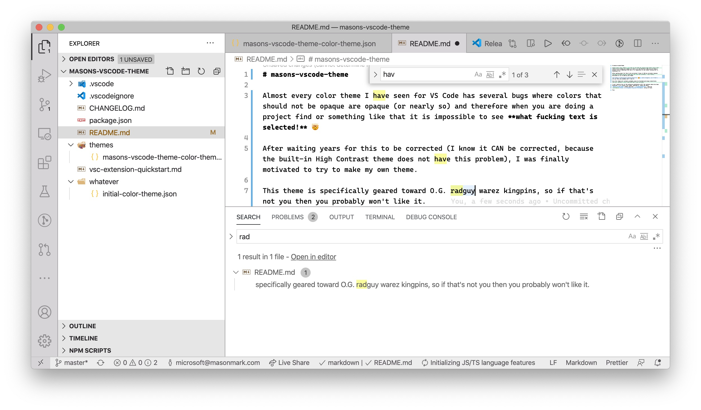
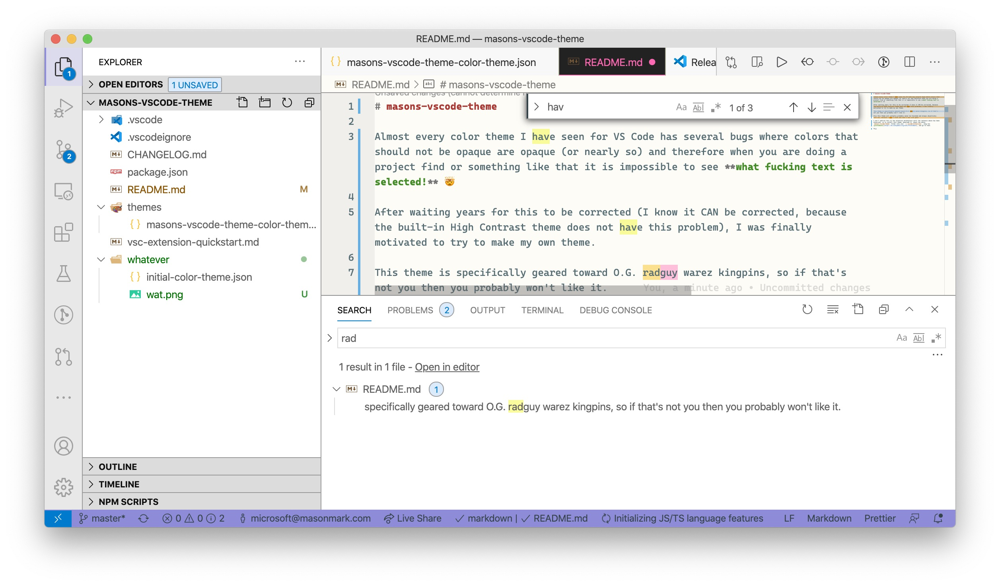

# masons-vscode-theme

Almost every color theme I have seen for VS Code has several bugs where colors that should not be opaque are opaque (or nearly so) and therefore when you are doing a project find or something like that it is impossible to see **what fucking text is selected!** 🤯

After waiting years for this to be corrected (I know it CAN be corrected, because the built-in High Contrast theme does not have this problem), I was finally motivated to try to make my own theme.

This theme is specifically geared toward O.G. radguy warez kingpins, so if that's not you then you probably won't like it.

Also, this theme will actually probably never be finished and always objectively suck ass, because I have 3 kids and that's how life goes!

I won't publish this on the extension marketplace until the sentence above has been disproven, so to install this theme you need to download it, whack the whole `masons-vscode-theme` folder into your `~/.vscode/extensions`, chug two [picklebacks](https://en.wikipedia.org/wiki/Pickleback), and then go to town.

## before

## after

以上
